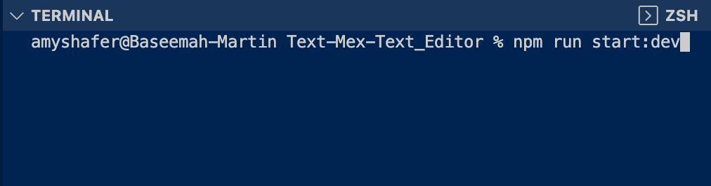
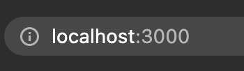
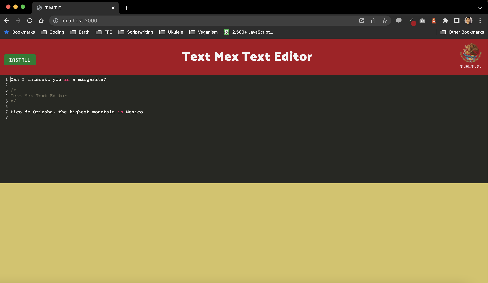

# Text Mex Text Editor

Inspired by a hungry developer's hankering for Mexician cuisine, Text Mex Text Editor delights users with a single page experience sure to entice them with future Progressive Web Application creations. Data persistence and offline capabilities are just a few of the fresh and spicy stars of this technological foray into more modern design patterns.

## Table of contents

- [Technologies](#technologies)
- [Mockup](#mockup)
- [Resources-used](#resources-used)
- [Possible-improvements](#possible-improvements)
- [Github-url](#github-url)
- [Deployed-url](#deployed-url)
- [Author](#author)
- [Licensing](#licensing)

---

## Technologies

This application was cooked up using starter code, node.js, Webpack, and a package called idb.

## Mockup

To begin, open VS Code's Terminal and type "npm run start:build".

Second, enter "localhost:3000" into your address bar.

Finally, check out the application. Install the app to try it offline!

## Resources-used

I visited the docs for Service Workers.

I sought out some background info on WebPack.

I needed some pointers with IndexDB.

I had a snack.

## Possible-improvements

I had a hard time with ASCII Art and decided to save the struggle for a future iteration of the project.

## Github-url

<a href="https://github.com/AmyShafer/Text-Mex-Text-Editor">Text Mex Text Editor Repo</a>

## Deployed-url

<a href="https://git.heroku.com/text-mex-text-editor.git">Text Mex Text Editor URL</a>

## Author

This application was created by Amy U. Shafer. You can send her vegan enchiladas recipes at Amy.U.Shafer@gmail.com.

## Licensing

MIT License

Copyright (c) 2022 Amy U. Shafer

Permission is hereby granted, free of charge, to any person obtaining a copy
of this software and associated documentation files (the "Software"), to deal
in the Software without restriction, including without limitation the rights
to use, copy, modify, merge, publish, distribute, sublicense, and/or sell
copies of the Software, and to permit persons to whom the Software is
furnished to do so, subject to the following conditions:

The above copyright notice and this permission notice shall be included in all
copies or substantial portions of the Software.

THE SOFTWARE IS PROVIDED "AS IS", WITHOUT WARRANTY OF ANY KIND, EXPRESS OR
IMPLIED, INCLUDING BUT NOT LIMITED TO THE WARRANTIES OF MERCHANTABILITY,
FITNESS FOR A PARTICULAR PURPOSE AND NONINFRINGEMENT. IN NO EVENT SHALL THE
AUTHORS OR COPYRIGHT HOLDERS BE LIABLE FOR ANY CLAIM, DAMAGES OR OTHER
LIABILITY, WHETHER IN AN ACTION OF CONTRACT, TORT OR OTHERWISE, ARISING FROM,
OUT OF OR IN CONNECTION WITH THE SOFTWARE OR THE USE OR OTHER DEALINGS IN THE
SOFTWARE.
